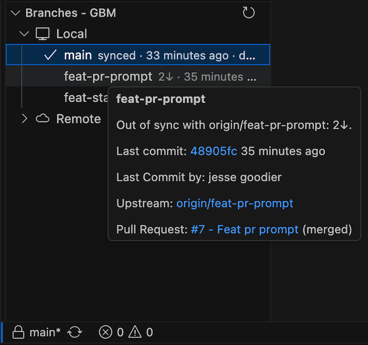

#  Good Branch Manager

A simple branch manager focused on the most common workflows when using git. Lives in the **Source Control** sidebar as a "Branches GBM" section.



## Installation

Download the latest `.vsix` package from the [GitHub Releases](https://github.com/jessegoodier/good-branch-manager-extension/releases) page, then install it from VS Code by opening the Extensions view, clicking the three-dot menu, selecting "Install from VSIX...", and choosing the downloaded `.vsix` file.

Or install it from the command line:

```sh
code --install-extension good-branch-manager-<version>.vsix
```

The release workflow packages each version and attaches the VSIX package to the release.

## Features

- **Branch list** showing local and remote branches sorted by most recent commit, with the current branch highlighted.
- **Sync indicators**: Highlights the checked-out branch with an icon and shows sync state (`local only`, `synced`, `ahead/behind` counts, or `upstream gone`).
- **Quick checkout**: Click any branch to switch to it (clicks on remote branches automatically set up tracking).
- **Branch management actions** (available on right-click):
  - *Create Branch From This...*
  - *Open Branch on GitHub* (or other remote host)
  - *Create Pull Request...* (creates GitHub PRs using VS Code's built-in auth)
  - *Rename Branch...*
  - *Merge Into Current Branch*
  - *Pull...* (supports default config, rebase, explicit merge, and fast-forward options)
  - *Set/Remove Upstream...*
  - *Delete Branch...* (optionally cleans up the remote counterpart)
- **Automatic & background refresh**: Auto-refreshes on repository changes (commits, checkouts, pushes/fetches).
- **Publish-to-PR prompt**: When the checked-out branch is first published to GitHub, asks whether to create a pull request.
- **Stale & merged hints**: Shows last commit age and flags merged or stale branches.

## Settings

| Setting | Default | Description |
| ------- | ------- | ----------- |
| `goodBranchManager.branchScope` | `both` | Show `both` local and remote branches, or `local` only |
| `goodBranchManager.staleAfterDays` | `10` | Days without commits before a branch is tagged stale (0 disables) |
| `goodBranchManager.refreshIntervalMins` | `1` | Background refresh interval in minutes (0 disables) |
| `goodBranchManager.defaultBranch` | `""` | Override the detected default branch used for merge/PR defaults |
| `goodBranchManager.showPrStatus` | `true` | Fetch pull request status from GitHub and show open, merged, or closed PR indicators |
| `goodBranchManager.promptForPrOnPublish` | `true` | Ask whether to create a GitHub pull request after publishing the checked-out branch |

## Development

```sh
npm install
npm run compile   # or: npm run watch
```

Press `F5` in VS Code to launch an Extension Development Host, or package with `npx @vscode/vsce package` and install the generated `.vsix`.
